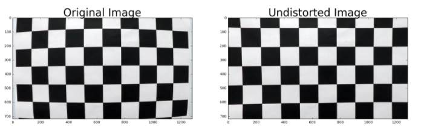

**Advanced Lane Finding Project**

The goals / steps of this project are the following:

* Compute the camera calibration matrix and distortion coefficients given a set of chessboard images.
* Apply a distortion correction to raw images.
* Use color transforms, gradients, etc., to create a thresholded binary image.
* Apply a perspective transform to rectify binary image ("birds-eye view").
* Detect lane pixels and fit to find the lane boundary.
* Determine the curvature of the lane and vehicle position with respect to center.
* Warp the detected lane boundaries back onto the original image.
* Output visual display of the lane boundaries and numerical estimation of lane curvature and vehicle position.

### 1. Camera Calibration

The first step in the project is camera calibrations which is done with the provided images in the camera_cal folder. Using `findChessboardCorners` the corners are extracted and fed into the `calibrateCamera` function. This function then provides us with our image matrix and the distortion coefficents. 

The code for this step is contained in the function `undistort` lines 8 - 48 in the file `advanced_lane_dection.py`. I started by preparing "object points" `objpoints`, which consists of the `(x, y, z)` coordinates of the chessboard corners in the world. Here I am assuming the chessboard is fixed on the `(x, y)` plane at `z=0`, such that the object points are the same for each calibration image.  Thus, `objp` is just a replicated array of coordinates, and `objpoints` will be appended with a copy of it every time I successfully detect all chessboard corners in a test image.  `imgpoints` will be appended with the `(x, y)` pixel position of each of the corners in the image plane with each successful chessboard detection.  

I then used the output `objpoints` and `imgpoints` to compute the camera calibration and distortion coefficients using the `cv2.calibrateCamera()` function.  I applied this distortion correction to the test image using the `cv2.undistort()` function and obtained this result: 

#### 2. Describe how (and identify where in your code) you performed a perspective transform and provide an example of a transformed image.

The code for my perspective transform includes a function called `transform_perspective()`, which appears in lines 54 through 63 in the source file.  The `transform_perspective()` function takes as inputs an undistortet image and transforms it to the perspective that I want to. The output for the test images looks as follows:

The following source and destination points are picked:

| Source        | Destination   | 
|:-------------:|:-------------:| 
| 572, 465      | 170, 0        | 
| 712, 465      | 1030, 0       |
| 285, 670      | 170, 650      |
| 1030, 670     | 1030,650      |

#### 3. Describe how (and identify where in your code) you used color transforms, gradients or other methods to create a thresholded binary image.  Provide an example of a binary image result.

I tried various methods to create a threshold binary image, including a combination of color and gradient thresholds. This effort can be reflected through my functions `abs_sobel_thresh`,`mag_thresh`,`dir_threshold`,`hls_select`, `abs_sobel`, and `yellow_white_filter` from lines 68 to 168. It seems that `yellow_white_filter` yields the best results. Here's an example of my output for this step.  

#### 4. Describe how (and identify where in your code) you identified lane-line pixels and fit their positions with a polynomial?

Then I used the `detect_lanes` function (line 171-254) in my program to detect lines in the program and fit polynomials to the detected lines. I used the sliding window based histogram approach first to identify the position of the lines in a 9 layer subsegmentation of the image and then used the `polyfit` functions to fit the polynomials to it. the output looked like this on the test images:

#### 5. Describe how (and identify where in your code) you calculated the radius of curvature of the lane and the position of the vehicle with respect to center.
The formula for the radius of curvature at any point `x` for the curve `y = f(x)` is given by:

I implemented this formula in lines 256 through 284 in my code in with the functions `get_curvature` and `get_offset`.

#### 6. Provide an example image of your result plotted back down onto the road such that the lane area is identified clearly.

I implemented this step in lines 244 through 261 in my code in the function `project_back`.  Here is an example of my result on a test image:

---

### Pipeline (video)

Here's a [link to my video result](project_video_out.mp4). The implemented approach captures the lanes well in the video. 

---

### Discussion
This is a quite intense project for me since I have a lot to catch up in CV. Finishing this one is as rewarding as it is difficult. I had issues with combining different methods to generate a best performing binary image. Right now this process is still trial-and-error based. An automated ("intelligent") way to decide which approach to adopt will be helpful to make this code more applicable to real world scenarios. To furthur expore this project, I may add sanity checks to the lanes detected, for example, whether the lane curvatures make sense and whether the lanes are parallel to each other.
